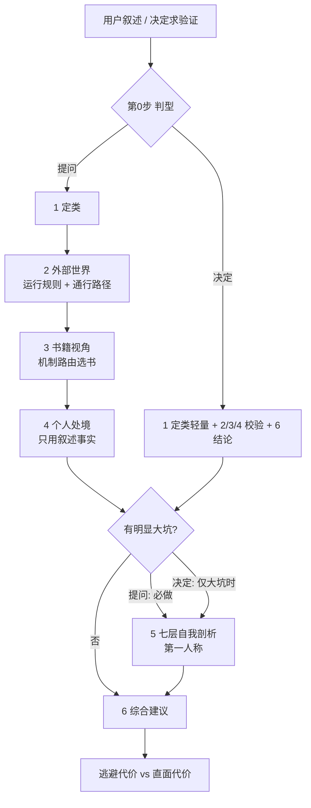

## 这个 skill 在做什么

一句话：**帮人看清一个纠结的选择——先把世界看清楚，再把人放回去，最后逼他看见自己没承认的东西。**

```mermaid
flowchart TD
    A[用户叙述 / 决定求验证] --> B{第0步 判型}
    B -->|提问| C[1 定类]
    B -->|决定| D[1 定类轻量 + 2/3/4 校验 + 6 结论]
    C --> E[2 外部世界<br/>运行规则 + 通行路径]
    E --> F[3 书籍视角<br/>机制路由选书]
    F --> G[4 个人处境<br/>只用叙述事实]
    G --> H{有明显大坑?}
    D --> H
    H -->|提问: 必做| I[5 七层自我剖析<br/>第一人称]
    H -->|决定: 仅大坑时| I
    H -->|否| J[6 综合建议]
    I --> J
    J --> K[逃避代价 vs 直面代价]
```

